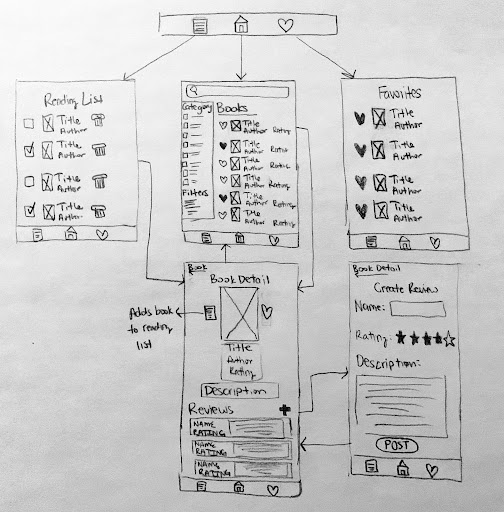

Original App Design Project - README Template
===

# BOOK APP

## Table of Contents

1. [Overview](#Overview)
2. [Product Spec](#Product-Spec)
3. [Wireframes](#Wireframes)
4. [Schema](#Schema)
5. [Video](#Video)

## Overview

### Description

An app where users can search/browse books, look at the book details (separate page), and favorite books (will have separate page of favorited books). 

### App Evaluation

- **Category:** Entertainment
- **Mobile:** It is great for quick searches and managing reading lists on-the-go.
- **Story:** It will allow for users to keep note of books they would like to read.
- **Market:** This will be useful to students, book lovers, and the general public. 
- **Habit:** Could have a medium habit potential if people use it each time they want book recommendations.
- **Scope:** Could have a medium scope, book data will be pulled from public API

## Product Spec

### 1. User Stories (Required and Optional)

**Required Must-have Stories**

* User can browse books
* User can search for a book
* User can favorite a book
* User can view list of favorited books
* User can select a book to view its details

**Optional Nice-to-have Stories**

* User can sign up / login
* User can view author profiles
* User can follow authors
* User will have their own profile
* Users can message each other
* User can write a review for a book
* User can add books to reading-list
* User can delete & check off books from reading-list

### 2. Screen Archetypes

- Home Screen
    - User can view list of books
    - Search bar and filters
    - User can favorite books
- Book Details
    - User can view the book details
    - User can write a review
    - User can favorite the book
    - User can add the book to their reading list
- Favorites Page
    - User can view favorited books
    - User can remove book from favorites

### 3. Navigation

**Tab Navigation** (Tab to Screen)

* Home Page
* Reading List

**Flow Navigation** (Screen to Screen)

- Home
    -> Book Details
- Book Details
    -> Home
- Favorites Page

## Wireframes

### [BONUS] Digital Wireframes & Mockups

### [BONUS] Interactive Prototype

## Schema 

[This section will be completed in Unit 9]

### Models

[Add table of models]

### Networking

- [Add list of network requests by screen ]
- [Create basic snippets for each Parse network request]
- [OPTIONAL: List endpoints if using existing API such as Yelp]

### Video

<iframe src="https://www.loom.com/embed/947b26ce06034d00994b29eef8454a97?sid=e927e925-e441-4630-9e0e-5330f61f9829" frameborder="0" webkitallowfullscreen mozallowfullscreen allowfullscreen style="position: absolute; top: 0; left: 0; width: 100%; height: 100%;"></iframe>

